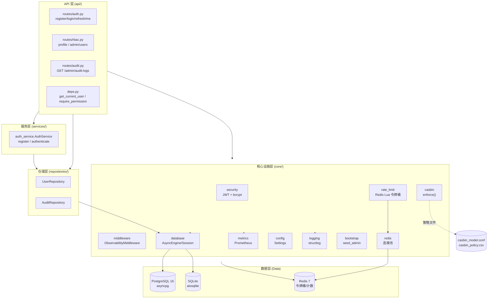
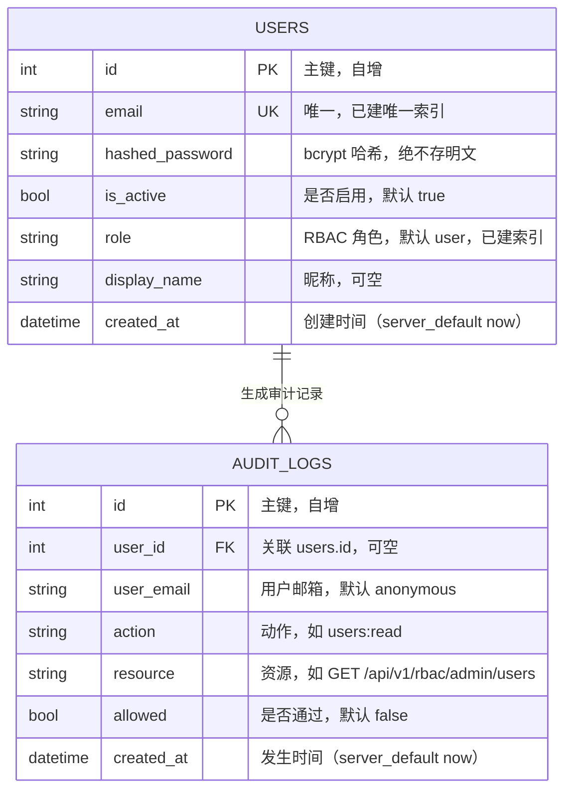
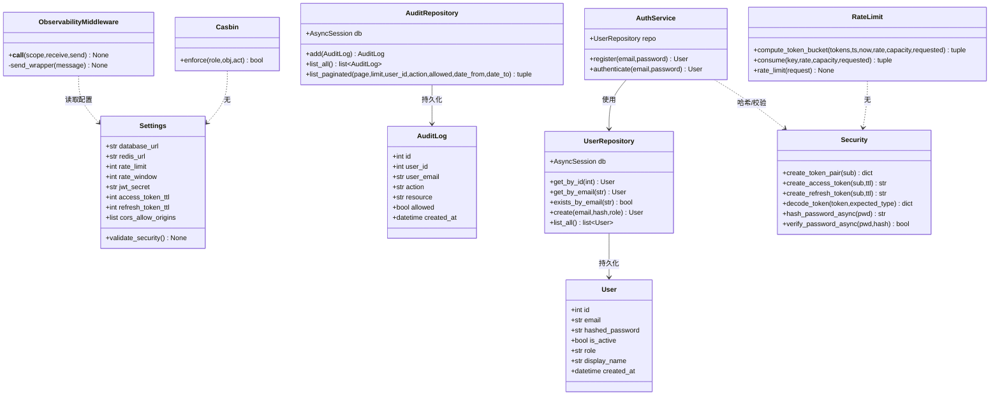
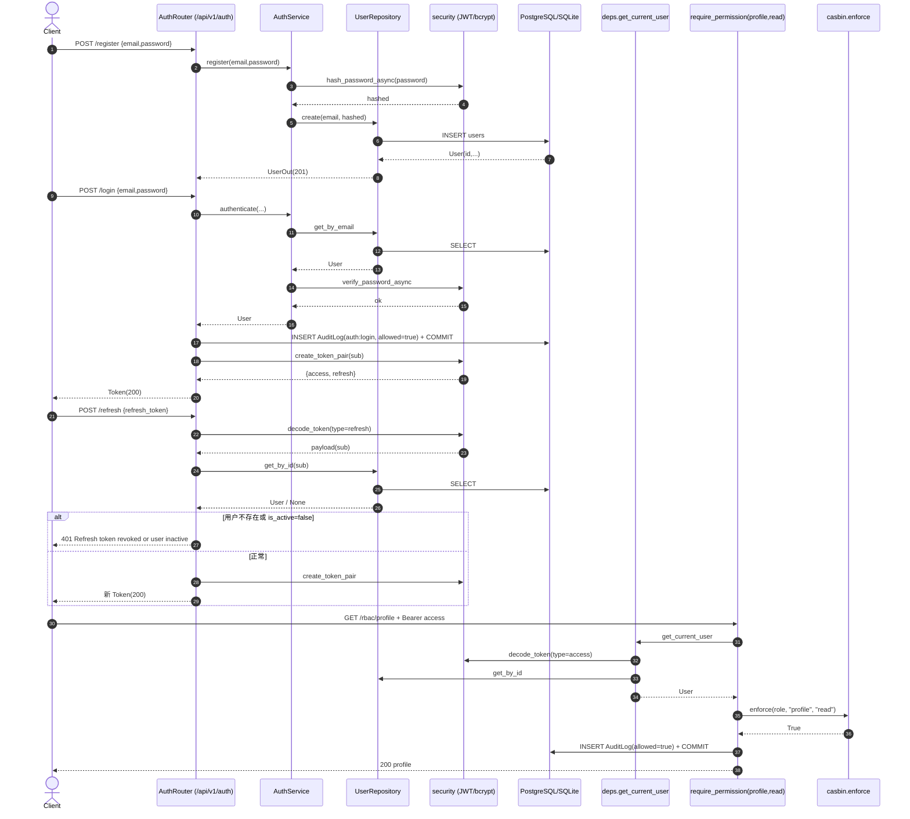
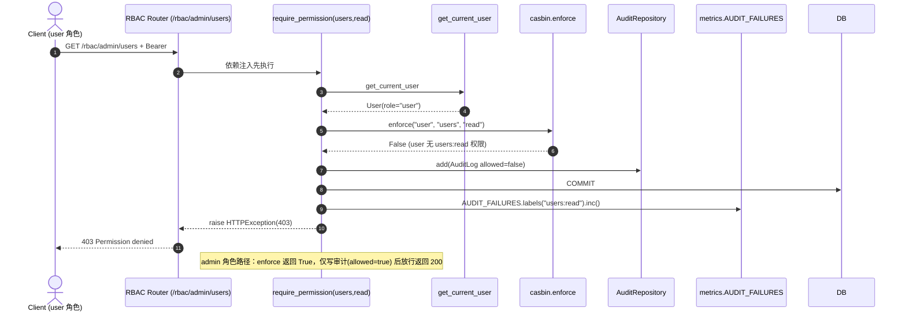
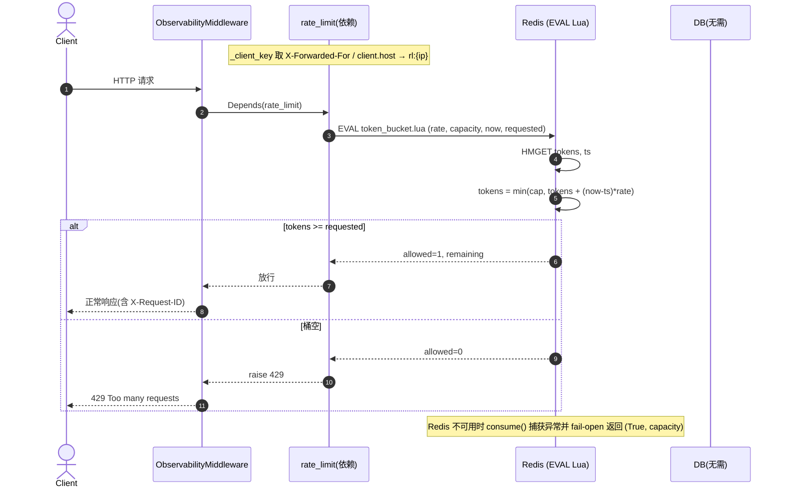
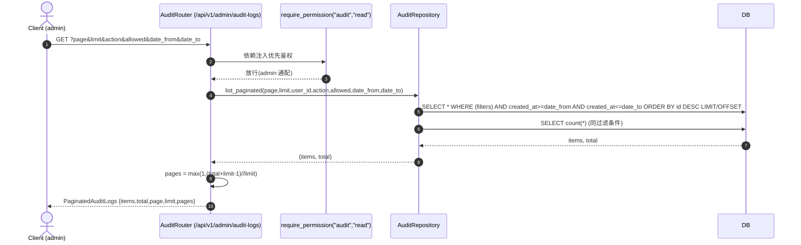
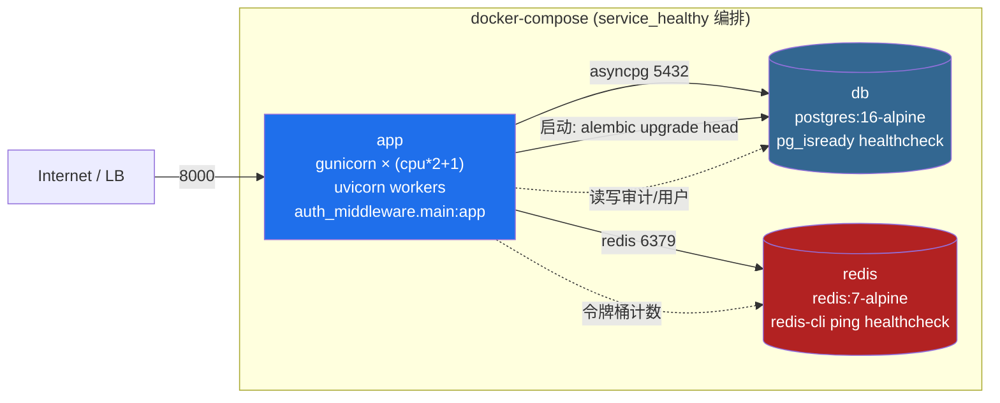

# 生产级认证与授权中台 · 开发详细设计文档

> 本文档基于 Phase 1-6 实现 + 漏洞修复后整理。

- 项目名称：生产级认证与授权中台
- 代码路径：`D:\code\auth-middleware`
- 技术栈：FastAPI + SQLAlchemy async + PostgreSQL/SQLite + Redis + casbin(RBAC) + bcrypt + JWT(python-jose/PyJWT) + Prometheus + structlog + gunicorn + Docker
- 文档语言：简体中文
- 测试状态：全量 pytest **33 passed + 1 skipped**（1 skipped 为 Redis 不可达时的 HTTP 429 验证用例）

---

## 目录

1. [系统架构与分层](#1-系统架构与分层)
2. [技术栈与关键选型理由](#2-技术栈与关键选型理由)
3. [数据模型（ER）](#3-数据模型er)
4. [类/模块图](#4-类模块图)
5. [核心接口定义](#5-核心接口定义)
6. [关键调用时序图](#6-关键调用时序图)
7. [部署架构](#7-部署架构)
8. [Alembic 迁移策略](#8-alembic-迁移策略)
9. [已修复 bug 的设计说明](#9-已修复-bug-的设计说明)

---

## 1. 系统架构与分层

系统采用清晰的**分层 + 依赖注入（DI）**架构。上层组件依赖下层**抽象**（仓储/服务接口），下层不反向依赖上层，依赖方向严格单向向下，便于独立测试与替换实现。



### 分层边界与依赖方向

| 层 | 目录 | 职责 | 允许依赖 |
|----|------|------|----------|
| **API 层** | `api/routes/*`、`api/deps.py` | HTTP 协议处理、参数校验（Pydantic）、路由装配、依赖注入鉴权 | 服务层、仓储层、core（casbin/security/rate_limit/metrics/logging） |
| **服务层** | `services/auth_service.py` | 业务规则（注册去重、登录认证含 `is_active` 校验），不碰 HTTP | 仓储层、core（security） |
| **仓储层** | `repositories/*` | 封装所有 SQL/ORM 访问，对上层提供领域对象 | core.database（会话）、models |
| **核心设施层** | `core/*` | 横切能力：安全、限流、可观测、授权引擎、配置、日志、连接池 | 配置、models、外部存储（PG/SQLite/Redis） |
| **数据层** | PostgreSQL / SQLite / Redis | 持久化与中心化限流存储 | — |

**关键设计点**：
- `get_db` 通过 FastAPI 依赖注入为每个请求提供独立 `AsyncSession`，用完自动关闭；测试期用 `dependency_overrides` 替换为内存 SQLite，实现用例隔离。
- `require_permission` 作为**路由级依赖工厂**，把「认证 + RBAC 鉴权 + 审计落库 + 越权计数」收敛到一处，所有受保护接口复用，避免鉴权逻辑散落。
- 可观测中间件（`ObservabilityMiddleware`）挂在 ASGI 最内层（CORS 在外），对 `/metrics` 与 `/metrics/` 直接透传，避免指标自污染。

---

## 2. 技术栈与关键选型理由

| 组件 | 版本/形式 | 选型理由 |
|------|-----------|----------|
| **FastAPI** | >=0.115 | 原生 async/await、基于 Pydantic 的自动参数校验与 OpenAPI 文档、依赖注入机制天然支撑分层与 `get_db`/`require_permission` 等复用。 |
| **SQLAlchemy async** | >=2.0.35 | `AsyncSession` + `async_engine` 全异步 ORM；`DeclarativeBase`/`Mapped` 类型注解式建模；SQLite(aiosqlite) 与 PostgreSQL(asyncpg) 共用同一套 ORM，切换只改连接串。 |
| **PostgreSQL / asyncpg** | 16 | 生产级关系库；`asyncpg` 为 PG 专属异步驱动，配合 `pool_size/max_overflow/pool_recycle` 做连接池调优。 |
| **SQLite / aiosqlite** | 默认 | 本地开发/测试开箱即用（StaticPool 单连接），CI 与单测用内存库隔离。 |
| **Redis + Lua 令牌桶** | >=5.0 / 7 | 中心化限流存储；用 Lua 脚本原子地完成「补充 + 扣减」，杜绝并发竞态；gunicorn 多 worker 各自进程池，正需 Redis 做跨进程统一计数。 |
| **casbin** | pycasbin >=1.26 | 策略与代码解耦：模型（`casbin_model.conf`）定义 RBAC 逻辑，策略（`casbin_policy.csv`）定义「谁有什么权限」；`enforce()` 为纯内存运算、零 I/O，可直接在 async 路由里同步调用。 |
| **bcrypt** | >=4.0.1 | 自适应成本哈希，抗暴力破解；直调 `bcrypt` 库（已确认与 passlib 不兼容），并包装为 `asyncio.to_thread` 避免阻塞事件循环。 |
| **JWT (PyJWT)** | >=2.9.0 | HS256 对称签名；access/refresh 用 payload `type` 字段区分，刷新时拒绝拿 access 来刷新，并为后续吊销预留扩展点。 |
| **Prometheus** | >=0.19.0 | `make_asgi_app()` 挂载 `/metrics`；Counter/Histogram/Gauge 暴露请求量、耗时、活跃用户、越权计数，对接 Grafana/Alertmanager。 |
| **structlog** | >=24.1.0 | 结构化日志（开发=彩色控制台，生产=`json_logs=True` 输出 JSON 行）；`bind(request_id,...)` 实现请求级上下文串联。 |
| **gunicorn + UvicornWorker** | >=22.0 | `pre-fork` 多进程模型绕过 GIL，用满多核；`workers = cpu_count*2+1`；`uvicorn.workers.UvicornWorker` 在每个 worker 内跑一个事件循环。 |
| **Docker / Compose** | postgres:16 / redis:7-alpine | 多阶段构建 + 非 root 运行；`depends_on: service_healthy` 保证应用启动前 DB/Redis 已就绪。 |
| **Alembic** | >=1.13.0 | 异步迁移环境；`render_as_batch=True` 让 SQLite 与 PG 的 ALTER 行为一致；生产建表交由迁移而非 `create_all`。 |

---

## 3. 数据模型（ER）

系统持久化两张核心表：`users`（账户）与 `audit_logs`（审计日志）。二者通过 `audit_logs.user_id → users.id` 外键关联（nullable，匿名/登录失败场景 `user_id` 为 NULL，用 `user_email` 溯源）。



### 字段明细

**users 表**

| 字段 | 类型 | 约束 | 说明 |
|------|------|------|------|
| `id` | Integer | PK，自增 | 用户标识，也是 JWT `sub` |
| `email` | String(255) | NOT NULL, UNIQUE, INDEX | 登录名；唯一索引 `ix_users_email` |
| `hashed_password` | String(255) | NOT NULL | bcrypt 哈希；响应模型 `UserOut` 不暴露 |
| `is_active` | Boolean | NOT NULL, default=True | 停用/注销后拒绝登录与会话刷新 |
| `role` | String(32) | NOT NULL, default="user", INDEX | RBAC 核心属性；唯一索引 `ix_users_role` |
| `display_name` | String(64) | NULL | 昵称（演示 `profile:write`） |
| `created_at` | DateTime(timezone=True) | NOT NULL, server_default=now() | 注册时间 |

**audit_logs 表**

| 字段 | 类型 | 约束 | 说明 |
|------|------|------|------|
| `id` | Integer | PK，自增 | 审计记录标识 |
| `user_id` | Integer | FK→users.id, NULL | 关联用户；匿名/失败为 NULL |
| `user_email` | String(255) | NOT NULL, default="anonymous" | 用户邮箱，保证可溯源 |
| `action` | String(128) | NOT NULL | 形如 `users:read`（obj:act） |
| `resource` | String(255) | NULL | 形如 `GET /api/v1/rbac/admin/users` |
| `allowed` | Boolean | NOT NULL, default=False | 拒绝也要记，才是审计价值点 |
| `created_at` | DateTime(timezone=True) | NOT NULL, server_default=now() | 发生时间，支持按范围过滤 |

### Alembic 迁移版本

| 版本 | Revision | 内容 |
|------|----------|------|
| initial | `ad367512aefc` | 建 `audit_logs`、`users` 两表；`ix_users_email`(唯一)、`ix_users_role`(普通) 索引。`down_revision=None`。 |
| add_audit_logs_user_id_fk | `df3cf6adbab3` | 为 `audit_logs.user_id` 加外键 `fk_audit_logs_user_id`→`users.id`（用 `batch_alter_table`，对 SQLite 重建表、对 PG 发原生 ALTER）。`down_revision=ad367512aefc`。 |

> 注意：initial 版本虽建了两表，但**初始未加外键**（PG 上 `created_at` 用 `CURRENT_TIMESTAMP` 文本默认），外键在第二个版本补齐，体现迁移的增量、可回滚特性。

---

## 4. 类/模块图



### 模块职责表（共 23 个源模块）

| 模块 | 类型 | 关键对外 API | 职责 |
|------|------|--------------|------|
| `main.py` | 入口 | `app`, `lifespan()` | 装配 FastAPI、CORS、ObservabilityMiddleware、`/metrics`、三路由组、`/health` |
| `core/bootstrap.py` | 启动 | `seed_admin()` | 演示用：admin 不存在则创建（role=admin） |
| `core/config.py` | 配置 | `settings`, `Settings.validate_security()` | 12-factor 配置（AUTH_ 前缀环境变量），生产 JWT 缺省 fail-fast |
| `core/database.py` | 数据底座 | `engine`, `SessionLocal`, `Base`, `get_db()`, `init_db()` | 异步引擎（SQLite=StaticPool / PG=连接池调优）、会话工厂、DI |
| `core/security.py` | 安全 | `create_token_pair`, `decode_token`, `hash_password_async`, `verify_password_async` | JWT 签发/校验（type 区分）+ bcrypt 线程池包装 |
| `core/redis.py` | 缓存底座 | `init_redis`, `get_redis`, `redis_lifespan()` | 进程级连接池、lifespan 启停、fail-open |
| `core/rate_limit.py` | 限流 | `compute_token_bucket`, `consume`, `rate_limit` | Redis Lua 令牌桶 + 纯函数等价实现 |
| `core/middleware.py` | 可观测 | `ObservabilityMiddleware.__call__`, `send_wrapper` | 注入 X-Request-ID、抓真实状态码、structlog + Prometheus |
| `core/metrics.py` | 指标 | `REQUEST_COUNT`, `REQUEST_DURATION`, `ACTIVE_USERS`, `AUDIT_FAILURES` | Prometheus 指标定义 |
| `core/logging.py` | 日志 | `configure_logging`, `get_logger` | structlog 配置（JSON/Console 双模式） |
| `core/casbin.py` | 授权引擎 | `enforcer`(单例), `enforce(role,obj,act)` | 加载模型/策略，纯内存 RBAC 判定 |
| `models/user.py` | ORM | `User` | users 表映射 |
| `models/audit_log.py` | ORM | `AuditLog` | audit_logs 表映射 |
| `schemas/user.py` | Pydantic | `UserCreate/UserLogin/ProfileUpdate/UserOut` | 用户出入参校验/序列化 |
| `schemas/token.py` | Pydantic | `Token`, `RefreshRequest` | 令牌出入参 |
| `schemas/audit_log.py` | Pydantic | `AuditLogOut/AuditLogQueryParams/PaginatedAuditLogs` | 审计查询出入参（含 date_from/date_to） |
| `repositories/user_repository.py` | 仓储 | `UserRepository` | 用户 CRUD 封装 |
| `repositories/audit_repository.py` | 仓储 | `AuditRepository` | 审计记录写入 + 分页过滤查询 |
| `services/auth_service.py` | 服务 | `AuthService.register/authenticate` | 注册去重、登录认证（含 `is_active` 校验） |
| `api/deps.py` | 共享依赖 | `get_current_user`, `require_permission(obj,act)` | 解析 Bearer、接口级 RBAC 鉴权 + 审计落库 + 越权计数 |
| `api/routes/auth.py` | 路由 | `register/login/refresh/me` | 认证路由（含登录审计、refresh 回查） |
| `api/routes/rbac.py` | 路由 | `/rbac/profile`(GET/PUT), `/rbac/admin/users`(GET) | RBAC 演示路由 |
| `api/routes/audit.py` | 路由 | `GET /admin/audit-logs` | 审计日志查询（admin，支持 date_from/date_to） |

---

## 5. 核心接口定义

### 5.1 服务层 — `AuthService`（services/auth_service.py）

| 签名 | 用途 |
|------|------|
| `async def register(self, email: str, password: str) -> User` | 注册；邮箱已存在抛 `EmailAlreadyExists`，否则 bcrypt 哈希后入库 |
| `async def authenticate(self, email: str, password: str) -> User \| None` | 登录认证；用户不存在/口令错/已被停用(`is_active=False`) 均返回 `None` |

### 5.2 仓储层

**UserRepository**（repositories/user_repository.py）

| 签名 | 用途 |
|------|------|
| `async def get_by_id(self, user_id: int) -> User \| None` | 按主键查用户（get_current_user / refresh 回查） |
| `async def get_by_email(self, email: str) -> User \| None` | 按邮箱查（登录/种子） |
| `async def exists_by_email(self, email: str) -> bool` | 注册去重判断 |
| `async def create(self, email, hashed_password, role="user") -> User` | 新增用户并 flush/refresh |
| `async def list_all(self) -> list[User]` | 管理员列出全部用户 |

**AuditRepository**（repositories/audit_repository.py）

| 签名 | 用途 |
|------|------|
| `async def add(self, log: AuditLog) -> AuditLog` | 挂入会话（由调用方统一 commit，便于与业务事务一致） |
| `async def list_paginated(self, page=1, limit=20, user_id=None, action=None, allowed=None, date_from=None, date_to=None) -> tuple[list[AuditLog], int]` | **分页+多条件过滤**（含时间区间），返回 `(items, total)`；时间倒序 |

### 5.3 限流 — `rate_limit.py`

| 签名 | 用途 |
|------|------|
| `def compute_token_bucket(tokens, ts, now, rate, capacity, requested: int = 1) -> tuple[bool, float]` | **纯函数版令牌桶**（与 Lua 等价），用于单测，不依赖 Redis。参数顺序刻意与 `consume()`/Lua 一致：`(tokens, ts, now, rate, capacity, requested)` |
| `async def consume(key, rate, capacity, requested=1) -> tuple[bool, float]` | 在 Redis 上 `EVAL` Lua 原子地「补充+扣减」；**Redis 不可用时 fail-open 返回 `(True, capacity)`** |
| `async def rate_limit(request: Request) -> None` | FastAPI 依赖；按客户端 IP 限流，超限抛 `429` |

### 5.4 可观测 — `middleware.py`

| 签名 | 用途 |
|------|------|
| `async def ObservabilityMiddleware.__call__(self, scope, receive, send) -> None` | ASGI 入口；对非 `/metrics` 请求注入 `request_id`、`start` 计时、调用下游 |
| `async def send_wrapper(message: Message) -> None` | 包裹 `send`：在 `http.response.start` 抓取**真实 status**并注入 `X-Request-ID`，随后透传给原始 `send` |

### 5.5 安全 — `security.py`

| 签名 | 用途 |
|------|------|
| `def create_access_token(sub, ttl=None) -> str` | 签发 access token（type=access） |
| `def create_refresh_token(sub, ttl=None) -> str` | 签发 refresh token（type=refresh，默认 7 天） |
| `def create_token_pair(sub) -> dict` | 一次签发 access+refresh 对 |
| `def decode_token(token, expected_type=None) -> dict` | 校验/解码 JWT；类型不符抛 `InvalidTokenError` |
| `async def hash_password_async / verify_password_async` | 线程池内跑 bcrypt，避免阻塞事件循环 |

### 5.6 共享依赖 — `api/deps.py`

| 签名 | 用途 |
|------|------|
| `async def get_current_user(credentials, db) -> User` | 解析 Bearer→`decode_token(type=access)`→`get_by_id`；缺失/失效/`is_active=False` 均 `401` |
| `def require_permission(obj, act) -> Callable[..., Awaitable[User]]` | 依赖工厂：先 `get_current_user`，再 `casbin_enforce(role,obj,act)`，无论结果都写审计并 commit；拒绝时 `AUDIT_FAILURES.inc()` + `403` |

---

## 6. 关键调用时序图

### ① 注册 → 登录 → 刷新令牌 → 带权访问受保护路由



### ② RBAC 鉴权（casbin enforce + 审计 + 越权计数）



### ③ 限流（Redis Lua 令牌桶）



### ④ 审计日志落库与查询（含 date_from / date_to 过滤）



> date_from/date_to 在 `AuditRepository.list_paginated` 与 `routes/audit.py` **两端同时透传接线**，是 OQ-2 修复点：路由把 `Query` 参数原样传给仓储，仓储拼接 `created_at >= date_from AND created_at <= date_to` 到 SELECT 与 count 语句。

### ⑤ 可观测（ObservabilityMiddleware 注入 X-Request-ID + /metrics）

```mermaid
sequenceDiagram
    autonumber
    actor C as Client
    participant MW as ObservabilityMiddleware
    participant APP as FastAPI App
    participant M as /metrics (prometheus app)
    participant LOG as structlog
    participant MET as REQUEST_COUNT / REQUEST_DURATION

    C->>MW: HTTP 请求 (非 /metrics)
    MW->>MW: request_id = uuid4()[:8]; start = monotonic()
    MW->>APP: call app (wrap send → send_wrapper)
    APP-->>MW: http.response.start {status}
    MW->>MW: status_holder["code"] = status; headers["X-Request-ID"] = request_id
    APP-->>C: 响应(含 X-Request-ID)
    MW->>LOG: bind(request_id,status,...); info / warn / error
    MW->>MET: REQUEST_COUNT.labels(method,path,status).inc(); REQUEST_DURATION.observe(dur)

    Note over MW: /metrics 与 /metrics/ 直接透传，不参与计数/日志/X-Request-ID 注入
    C->>M: GET /metrics
    M-->>C: Prometheus 文本 (auth_request_total 含真实 status 标签)
```

---

## 7. 部署架构

生产部署由 `docker-compose.yml` 编排三个服务：`db`(PostgreSQL 16) + `redis`(Redis 7) + `app`(FastAPI/gunicorn)。`app` 通过 `depends_on: condition: service_healthy` 等待 DB 与 Redis 探活通过后再启动；容器内启动命令先跑 `scripts/migrate.py`（等价 `alembic upgrade head`，幂等）再起 gunicorn。

### Dockerfile 要点

- **多阶段构建**：`builder` 阶段用 `python:3.13-slim` 建 venv 并 `pip install .`；`runtime` 阶段只复制 venv + 运行所需文件（不含构建工具、不含宿主机 `.venv`），镜像更小。
- **非 root 运行**：`useradd --uid 1000 appuser` 并 `chown -R appuser /app`，以低权限用户启动，`EXPOSE 8000`。
- **启动命令**：`python scripts/migrate.py && gunicorn -c gunicorn.conf.py auth_middleware.main:app`。

### gunicorn worker 公式

```python
workers = multiprocessing.cpu_count() * 2 + 1   # pre-fork 多进程，绕过 GIL
worker_class = "uvicorn.workers.UvicornWorker"   # 每 worker 内一个事件循环
worker_connections = 1000
```

### 部署图



### docker-compose 关键配置

| 服务 | 镜像 | healthcheck | 依赖 |
|------|------|-------------|------|
| `db` | `postgres:16-alpine` | `pg_isready -U ${POSTGRES_USER:-auth}` | — |
| `redis` | `redis:7-alpine` | `redis-cli ping` | — |
| `app` | 本地 build | 无（依赖下方条件） | `db: service_healthy`、`redis: service_healthy` |

> 应用通过环境变量注入：`AUTH_DATABASE_URL=postgresql+asyncpg://...@db:5432/...`、`AUTH_REDIS_URL=redis://redis:6379/0`、`AUTH_JWT_SECRET`（**务必覆盖**，否则 `validate_security()` 在生产 fail-fast）。

---

## 8. Alembic 迁移策略

| 设计点 | 说明 |
|--------|------|
| **异步环境** | `alembic/env.py` 复用应用的 `engine`（`AsyncEngine`），`run_migrations_online()` 用 `asyncio.run` + `connection.run_sync` 跑迁移，享受与运行期一致的连接池配置。 |
| **连接串来源** | `config.set_main_option("sqlalchemy.url", settings.database_url)`，迁移连的是**当前环境**库（= `AUTH_DATABASE_URL`），而非 `alembic.ini` 占位串。 |
| **`import auth_middleware.models`** | 必须导入，否则 ORM 表未注册到 `Base.metadata`，`autogenerate` 会误判「无表」导致漏迁移。 |
| **`render_as_batch=True`** | 对 SQLite：ALTER 操作以「重建表」实现（SQLite 不支持 `ALTER ADD CONSTRAINT`）；对 PostgreSQL：直接发原生 `ALTER`。**跨库安全**，使同一份迁移脚本在两种库都可用（见 `df3cf6adbab3` 用 `batch_alter_table` 加外键）。 |
| **`init_db()` 分流** | `init_db()` 仅当 `database_url` 以 `sqlite` 开头时才 `Base.metadata.create_all`；**PostgreSQL 等生产库直接 return**，建表职责交给 Alembic，保证 schema 版本化、可回滚、多环境一致。SQLite 走 `create_all` 是为本地/测试「开箱即跑」。 |
| **启动链路** | `Dockerfile` → `scripts/migrate.py`（`alembic upgrade head`，幂等可重复）→ `gunicorn` 启动；应用 `lifespan` 内仍调 `init_db()`（PG 下为 no-op）。 |

---

## 9. 已修复 bug 的设计说明

本次「集成测试 + 漏洞修复」共修复并接线 7 处设计与安全问题，要点如下：

### 9.1 ObservabilityMiddleware 必须抓 `http.response.start` 而非 `scope["status_code"]`
- **问题**：Starlette 的 `Response` **不会**把最终状态码写回 `scope["status_code"]`，直接读该值恒为默认 `200`。导致 4xx/5xx 永远记成 info 级、且 `REQUEST_COUNT` 的 `status` 标签永远失真，错误分级告警与监控形同虚设。
- **设计取舍**：在 `send_wrapper` 中拦截 `http.response.start` 消息，从 `message["status"]` 读取真实状态码写入可变容器 `status_holder`，再注入 `X-Request-ID` 并透传。这是 ASGI 层获取真实状态码的**唯一正确位置**。

### 9.2 `compute_token_bucket` 参数顺序统一
- **问题**：历史曾因纯函数版与 `consume()`/Lua 脚本对 `(rate, capacity)` 的形参顺序理解不一致，导致限流失效（把容量当速率、速率当容量）。
- **设计取舍**：强制统一为 `(tokens, ts, now, rate, capacity, requested)`，且首个形参名 `rate` 紧邻 `capacity`，与 `consume(key, rate, capacity, requested)` → Lua `ARGV=(rate, capacity, now, requested)` **逐位对应**。配套 `test_capacity_rate_order_matches_consume` 回归测试锁死该约定。

### 9.3 `/refresh` 增加用户状态回查（安全意义）
- **问题**：原 refresh 仅校验 refresh token 的签名/过期/类型，被停用或删除的用户（最长 7 天有效的 refresh token）仍可换发 access token，形成「已注销账号长期可用」的越权窗口。
- **设计取舍**：refresh 解码 `sub` 后**回查 `UserRepository.get_by_id`**，用户不存在或 `is_active=False` 即返回 `401 Refresh token revoked or user inactive`。与 `get_current_user` 的 `is_active` 校验形成一致闭环，使「停用/注销」立即对所有令牌类型生效。

### 9.4 登录审计落库 + `AUDIT_FAILURES` 越权计数接线
- **问题**：登录这一高危安全事件此前未记录审计；`metrics.AUDIT_FAILURES` 指标虽已定义却从未被 `inc()`，无法监控异常访问模式。
- **设计取舍**：`POST /login` 无论成功(`allowed=True`)/失败(`allowed=False`，用户不存在时 `user_id=None` 但 `user_email` 仍可溯源) 都写一条 `action="auth:login"` 审计并提交；`require_permission` 在拒绝路径额外 `AUDIT_FAILURES.labels(action).inc()`，使越权行为既入审计表又进入 Prometheus（`auth_audit_failures_total`）。

### 9.5 生产环境默认 JWT 密钥 fail-fast
- **设计取舍**：`Settings.validate_security()` 在 `lifespan` 启动早期调用；当 `debug=False`（生产）且 `jwt_secret` 仍为占位值 `"change-me-in-production"` 时**直接抛 RuntimeError 中止启动**，把「忘了配强随机密钥就上线」暴露在最早环节，避免以不安全签名运行。开发环境（`debug=True`）放行。

### 9.6 OQ-2：`GET /admin/audit-logs` 接收并透传 `date_from`/`date_to`
- **问题**：路由此前未声明/未透传时间过滤参数，导致审计查询无法按时间区间筛选（OQ-2）。
- **设计取舍**：`routes/audit.py` 用 `Query` 声明 `date_from: datetime | None` 与 `date_to: datetime | None`，原样传入 `AuditRepository.list_paginated`，仓储在 SELECT 与 count 两条语句上拼接 `created_at >= date_from AND created_at <= date_to`。回归测试 `test_audit_logs_date_range_filter` 插入不同时间戳记录并断言「过滤后总数严格小于不过滤」，证明过滤真正生效。

### 9.7 CORS 收敛为显式源、禁用通配符
- **设计取舍**：`allow_origins` 改为读取 `settings.cors_allow_origins`（默认**空列表 = 不开放任何跨域**），不再使用 `allow_origins=["*"]`，避免任意网站携带用户凭证调用本 API。运维通过 `AUTH_CORS_ALLOW_ORIGINS` 以逗号分隔显式配置可信前端源；`allow_credentials=True` 仅在显式源下才安全。

---

> 文档结束。所有图表与接口描述均基于 `src/auth_middleware` 真实源码、Alembic 迁移、`Dockerfile`/`docker-compose.yml`/`gunicorn.conf.py` 与 `tests/` 验证结果整理。
